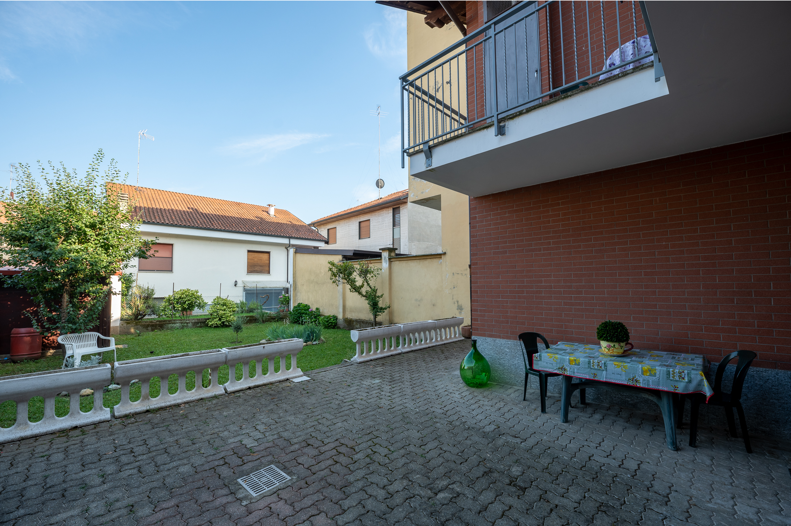

# Bolle Di Vetro — Sito Web Casa Vacanze

Benvenuto nella documentazione del sito web di **Bolle Di Vetro**, la tua struttura ricettiva per vacanze eleganti e rilassanti. Questa guida è pensata per essere semplice e accessibile anche a chi non ha competenze di programmazione.

---

## 1. Panoramica

Il sito web di **Bolle Di Vetro** è un sito web statico ad altissime prestazioni, moderno, reattivo (responsive) e multilingua (Italiano ed Inglese). È stato progettato per presentare al meglio i due appartamenti della struttura, permettere agli ospiti di visualizzare gallerie fotografiche interattive, verificare i servizi offerti, esplorare la mappa della posizione e accedere direttamente ai link di prenotazione su Airbnb e Booking.com.

- **Tecnologie usate**: HTML5, CSS3 vaniglia, JavaScript ES6 (senza dipendenze pesanti).
- **Lingue supportate**: Italiano (`it`) e Inglese (`en`).
- **Hosting consigliato**: Netlify (distribuzione continua automatica da GitHub).

---

## 2. Struttura del Progetto

Ecco l'organizzazione completa di tutti i file e directory all'interno del progetto:

```text
BolleDiVetro/
├── assets/                  # Risorse statiche (stili, script, immagini)
│   ├── css/                 # Fogli di stile CSS
│   │   ├── main.css         # Stili principali del sito
│   │   └── variables.css    # Variabili dei colori e tipografia
│   ├── js/                  # Script JavaScript
│   │   ├── main.js          # Inizializzazione e logica generale
│   │   ├── i18n.js          # Sistema di gestione multilingua
│   │   └── gallery.js       # Logica Lightbox e galleria fotografica
│   ├── img/                 # Immagini del sito
│   │   ├── hero.jpg         # Immagine di copertina principale
│   │   ├── og-image.jpg     # Immagine usata per la condivisione sui social
│   │   └── gallery/         # Foto degli appartamenti
│   │       ├── apt1/        # Galleria Appartamento 1 (es. foto-01.jpg, foto-02.jpg)
│   │       └── apt2/        # Galleria Appartamento 2 (es. foto-01.jpg, foto-02.jpg)
│   ├── docs/                # Documentazione di progetto
│   └── icons/               # Icone SVG e favicon
├── lang/                    # File di traduzione per i testi del sito
│   ├── it.json              # Testi in lingua Italiana
│   └── en.json              # Testi in lingua Inglese
├── index.html               # Pagina principale del sito
├── manifest.json            # Configurazione Progressive Web App (PWA) e favicon
├── netlify.toml             # Configurazione caching e sicurezza per Netlify
├── robots.txt               # Istruzioni per i motori di ricerca (SEO)
├── sitemap.xml              # Mappa del sito per indicizzazione Google
└── README.md                # Questa guida completa
```

---

## 3. Come Aggiornare i Contenuti

Questa è la sezione principale per personalizzare i testi, i dati di contatto, le foto ed i link del sito.

### Testi e Descrizioni

Tutti i testi mostrati nelle pagine non sono scritti direttamente nel file HTML, ma si trovano nei file JSON dentro la cartella `lang/`:
- `lang/it.json` per la versione italiana.
- `lang/en.json` per la versione inglese.

Per modificare un testo, apri il file desiderato con un editor di testo (es. VS Code o Blocco Note) e modifica il testo tra virgolette a destra dei due punti.

#### Esempio: Modificare la descrizione dell'Appartamento 1

**Prima della modifica (`lang/it.json`):**
```json
"apt1_description": "Descrizione temporanea dell'Appartamento 1. Inserire qui il testo descrittivo definitivo."
```

**Dopo la modifica (`lang/it.json`):**
```json
"apt1_description": "Splendido appartamento panoramico dotato di ampio terrazzo vista mare, finiture in vetro artistico e ogni comfort moderno per una vacanza indimenticabile."
```

> **Importante**: Assicurati di aggiornare contemporaneamente anche il file `lang/en.json` con la traduzione corrispondente!

---

### Foto

Le fotografie sono organizzate all'interno della cartella `assets/img/gallery/`:
- Appartamento 1: `assets/img/gallery/apt1/`
- Appartamento 2: `assets/img/gallery/apt2/`
- Immagine copertina principale: `assets/img/hero.jpg`

#### Convenzione Nomi e Dimensioni Consigliate:
- **Galleria appartamenti**: Usa nomi puliti come `foto-01.jpg`, `foto-02.jpg`, `foto-03.jpg`.
  - Dimensioni raccomandate: **1200 x 900 pixel** (rapporto 4:3).
- **Immagine Hero (Copertina)**: `assets/img/hero.jpg`
  - Dimensioni raccomandate: **1920 x 1080 pixel** (rapporto 16:9).
- **Compressione**: Prima di sostituire le foto, comprimile usando strumenti gratuiti online come [squoosh.app](https://squoosh.app) o [tinypng.com](https://tinypng.com).

---

### Link Airbnb e Booking

I pulsanti di prenotazione diretta si trovano nel file `index.html`. Apri `index.html` e cerca i commenti specifici nel codice:

1. Cerca il commento `<!-- BLOCCO_LINK_AIRBNB -->` per individuare i link verso Airbnb.
2. Cerca il commento `<!-- BLOCCO_LINK_BOOKING -->` per individuare i link verso Booking.com.
3. Sostituisci il link di esempio `href="#"` con l'indirizzo reale del tuo annuncio.

**Esempio di modifica in `index.html`:**
```html
<!-- BLOCCO_LINK_AIRBNB -->
<a href="https://www.airbnb.it/rooms/TUO_CODICE_ANNUNCIO" target="_blank" rel="noopener" class="btn btn--primary">
  Prenota su Airbnb
</a>
```

---

### Dati di Contatto

I dati di contatto (Nome referente, Telefono, Email) sono memorizzati nei file di traduzione sotto la chiave `BLOCCO_CONTATTI`.

Apri `lang/it.json` e `lang/en.json` e aggiorna le informazioni:
```json
"contact_name": "Mario Rossi",
"contact_phone": "+39 333 1234567",
"contact_phone_clean": "393331234567",
"contact_email": "info@bolledivetro.it"
```

---

### Mappa Google Maps

Per aggiornare la posizione della mappa interattiva:
1. Vai su [Google Maps](https://maps.google.com) e cerca l'indirizzo esatto della tua struttura.
2. Clicca su **Condividi** -> **Incorpora una mappa**.
3. Copia il link presente nel codice `src="..."` generato da Google.
4. Apri `index.html`, cerca il commento `<!-- BLOCCO_MAPPA -->` e sostituisci il valore dell'attributo `src` dell'iframe con il nuovo link.

---

### Sezione Recensioni

La sezione recensioni è disattivata di default finché non avrai raccolto le prime opinioni dei tuoi ospiti.

1. Per **attivarla**: apri `index.html`, individua il tag `<section id="reviews" class="section section--hidden">` e rimuovi la classe `section--hidden` in modo che diventi `<section id="reviews" class="section">`.
2. Per **aggiungere nuove schede recensione**, duplica un blocco card recensione esistente ed aggiorna nome ospite, data, punteggio e testo della recensione.

---

## 4. Come Aggiungere una Nuova Lingua

Se desideri aggiungere una nuova lingua al sito (ad esempio il Tedesco `de`):

1. **Crea il file di traduzione**:
   Copia `lang/it.json` e salvalo come `lang/de.json` nella cartella `lang/`.
2. **Traduci i testi**:
   Apri `lang/de.json` e traduci tutti i valori in tedesco mantenendo invariate le chiavi a sinistra.
3. **Aggiungi il pulsante nel selettore lingua**:
   In `index.html`, all'interno dell'intestazione (header), aggiungi il nuovo pulsante nel selettore lingua:
   ```html
   <button class="lang-btn" data-lang="de" aria-label="Deutsch">DE</button>
   ```
4. **Registra la lingua nello script**:
   Assicurati che `assets/js/i18n.js` riconosca la nuova lingua nell'array delle lingue supportate (`['it', 'en', 'de']`).

---

## 5. Come Aggiungere Foto alla Galleria

Per aggiungere una nuova fotografia alla galleria fotografica di un appartamento in `index.html`:

1. Salva la nuova immagine compressa nella cartella corrispondente (es. `assets/img/gallery/apt1/foto-04.jpg`).
2. Apri `index.html` nella sezione della galleria dell'appartamento.
3. Aggiungi il seguente elemento HTML all'interno del contenitore della galleria:

```html
<a href="assets/img/gallery/apt1/foto-04.jpg" 
   class="gallery__item" 
   data-lightbox="apt1" 
   data-caption="Vista panoramica dal balcone dell'Appartamento 1">
  
</a>
```

---

## 6. Deploy su Netlify

Il sito è pronto per essere pubblicato gratuitamente ed in modo automatizzato su **Netlify**.

### Procedura passo-passo:

1. **Crea un account**: Registrati su [Netlify.com](https://www.netlify.com/) (puoi accedere tramite GitHub).
2. **Carica il codice su GitHub**: Crea un nuovo repository su GitHub e carica tutti i file del progetto `BolleDiVetro`.
3. **Connetti il Repository**:
   - Nella dashboard di Netlify, clicca su **Add new site** -> **Import an existing project**.
   - Seleziona **GitHub** e autorizza l'accesso al tuo repository.
4. **Configura le impostazioni di Deploy**:
   - **Branch to deploy**: `main` (o `master`).
   - **Build command**: *lascia vuoto* (sito statico vaniglia).
   - **Publish directory**: `.` (oppure lascia vuoto/radice).
5. **Avvia la pubblicazione**: Clicca su **Deploy site**.
6. Ogni volta che invierai nuove modifiche su GitHub, Netlify aggiornerà il sito automaticamente in pochi secondi!

---

## 7. Test Locale

Puoi verificare le modifiche al sito sul tuo computer prima di pubblicarle online.

### Opzione 1: Con Python (consigliato se Python è installato)
Apri il terminale nella cartella del progetto `BolleDiVetro` ed esegui:
```bash
python -m http.server 8000
```
Apri il browser su `http://localhost:8000`.

### Opzione 2: Con Node.js / npx
Apri il terminale ed esegui:
```bash
npx serve .
```
Apri l'indirizzo indicato nel terminale (es. `http://localhost:3000`).

### Opzione 3: Estensione VS Code
Se usi Visual Studio Code, installa l'estensione **Live Server**, apri `index.html` e clicca su **Go Live** in basso a destra.

---

## 8. Ottimizzazione Immagini

Immagini troppo pesanti rallentano il sito e peggiorano il posizionamento su Google. Segui queste semplici regole:

- **Formato**: Usa `.jpg` per fotografie o `.webp` per massima efficienza.
- **Dimensioni massime**:
  - Immagini Hero (copertina): max **1920px** di larghezza.
  - Immagini Galleria: max **1200px** di larghezza.
- **Peso del file**:
  - Foto della galleria: ideale sotto i **200 KB**.
  - Foto hero: ideale sotto i **400 KB**.
- **Strumenti gratuiti**: Usa [Squoosh](https://squoosh.app) o [TinyPNG](https://tinypng.com) prima di caricare qualsiasi nuova immagine.

---

## 9. Checklist Prima della Pubblicazione

Prima di lanciare ufficialmente il sito web online, completa questa checklist per verificare di aver sostituito tutti i segnaposto temporanei:

- [ ] **Descrizione Appartamento 1** aggiornata sia in `lang/it.json` che in `lang/en.json`
- [ ] **Descrizione Appartamento 2** aggiornata sia in `lang/it.json` che in `lang/en.json`
- [ ] **Servizi Appartamento 1** controllati e tradotti (IT + EN)
- [ ] **Servizi Appartamento 2** controllati e tradotti (IT + EN)
- [ ] **Posizione e mappa** aggiornate con testo esplicativo (IT + EN)
- [ ] **Contatti** (nome referente, numero telefono, indirizzo email) verificati
- [ ] **Link Airbnb Appartamento 1** aggiornato con l'URL reale dell'annuncio
- [ ] **Link Booking Appartamento 1** aggiornato con l'URL reale dell'annuncio
- [ ] **Link Airbnb Appartamento 2** aggiornato con l'URL reale dell'annuncio
- [ ] **Link Booking Appartamento 2** aggiornato con l'URL reale dell'annuncio
- [ ] **Foto galleria Appartamento 1** caricate e collegate in `index.html`
- [ ] **Foto galleria Appartamento 2** caricate e collegate in `index.html`
- [ ] **Foto hero** sostituita in `assets/img/hero.jpg`
- [ ] **Coordinate e iframe mappa Google Maps** impostati in `index.html`
- [ ] **Dominio reale** inserito al posto di `example.com` in `sitemap.xml` e `robots.txt`
- [ ] **URL reali** aggiornati nei meta tag Open Graph (`og:url`, `og:image`) e `canonical` in `index.html`
- [ ] **Favicon personalizzata** inserita in `assets/img/favicon.ico`
